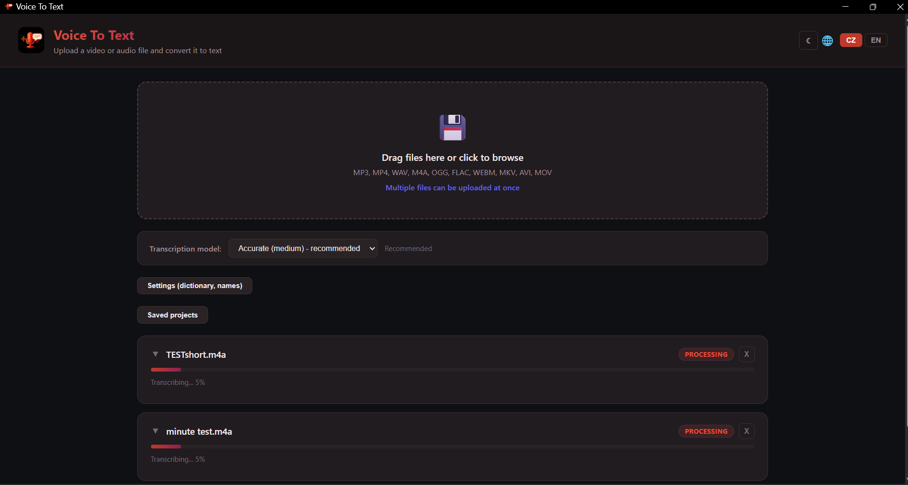

# Voice To Text

<p align="center">
  
</p>

<p align="center">
  <strong>Desktop app for transcribing video/audio to text with multi-language translation</strong>
</p>

<p align="center">
  
  
  
  
</p>

<p align="center">
  <a href="#features">Features</a> •
  <a href="#quick-start">Quick Start</a> •
  <a href="#how-it-works">How It Works</a> •
  <a href="#technologies">Technologies</a> •
  <a href="#česká-verze">Česká verze</a>
</p>

---

## Features

- **Audio/video transcription** with timestamps using Whisper AI
- **Editable transcript** — fix names, typos directly in the app
- **Search & highlight** — find phrases and mark them in red (preserved in PDF export)
- **Translation** to 7 languages (CZ, SK, EN, DE, PL, HU, RO) with proper name preservation
- **Export** to TXT, PDF, SRT (subtitles) or ZIP with everything
- **Batch processing** — upload multiple files at once with progress bars
- **Project save/load** — your work persists across restarts
- **Auto GPU detection** — automatically uses NVIDIA CUDA when available
- **Dark mode UI**

## Screenshot

<p align="center">
  
</p>

## Quick Start

### Windows (one-click installer)

```
1. Download or clone this repository
2. Run setup.bat (installs Python + dependencies + creates desktop shortcut)
3. Click the "Voice To Text" icon on your desktop
```

### Manual installation

```bash
pip install -r requirements.txt
python app.py
```

The app opens at `http://localhost:8000`

## How It Works

```
Video/Audio  ──>  Whisper AI  ──>  Text with timestamps
                                        │
                    ┌───────────────────┤
                    │                    │
              Search &              Edit text
              highlight             (fix names, typos)
                    │                    │
                    └───────────────────┤
                                        │
                         ┌──────────────┼──────────────┐
                         │              │              │
                      Export       Translation       Save
                   TXT/PDF/SRT    7 languages       project
                      /ZIP       + SRT subtitles
```

## Features in Detail

### Transcription
- **Whisper AI** (faster-whisper) optimized for Czech language
- 3 quality levels: small (fast), medium (recommended), large (most accurate)
- Automatic sentence merging (not word-by-word)
- Custom dictionary for automatic corrections

### Search & Highlight
- Full-text search across the transcript
- Matches highlighted in yellow
- Option to permanently mark phrases in red (highlighting carries over to PDF export)

### Translation
- Translate to 7 languages simultaneously
- Proper names are preserved (configurable list)
- Export translations as SRT subtitles

### Export

| Format | Description |
|--------|-------------|
| **TXT** | Plain text with timestamps `[00:01:23 - 00:01:45]` |
| **PDF** | Formatted document, marked phrases in red |
| **SRT** | Subtitles for video editor import |
| **ZIP** | Everything at once including all translations |

## Technologies

| Component | Technology |
|-----------|------------|
| Speech-to-Text | [faster-whisper](https://github.com/SYSTRAN/faster-whisper) |
| Backend | [FastAPI](https://fastapi.tiangolo.com/) + Uvicorn |
| Frontend | Vanilla JS, Dark Mode UI |
| Translation | [deep-translator](https://github.com/nidhaloff/deep-translator) (Google Translate) |
| PDF export | [fpdf2](https://github.com/py-pdf/fpdf2) + DejaVu fonts |
| GPU acceleration | CUDA (auto-detect) |

## Project Structure

```
VoiceToText/
├── app.py               # Main application (FastAPI server)
├── translator.py         # Translation with name protection
├── exporter.py           # Export to TXT, PDF, SRT
├── dictionary.txt        # Correction dictionary (editable)
├── names.txt             # Names that should not be translated
├── requirements.txt      # Python dependencies
├── setup.bat             # Automatic installer (Windows)
├── start.bat             # Application launcher
├── static/               # CSS, fonts, icon
├── templates/
│   └── index.html        # Frontend (single page app)
├── uploads/              # Uploaded files (gitignored)
├── outputs/              # Exported files (gitignored)
└── projects/             # Saved projects (gitignored)
```

## Portability

The app is designed to be easily transferred to another computer:

1. Copy the entire folder to the new PC
2. Run `setup.bat`
3. Done

Setup automatically:
- Installs Python (if missing)
- Installs all dependencies
- Detects and configures GPU (if NVIDIA is present)
- Downloads the language model
- Creates a desktop shortcut

---

## Česká verze

### Co aplikace umí

- **Přepis audia/videa na text** s časovými značkami
- **Editace přepisu** přímo v aplikaci (oprava jmen, překlepů)
- **Hledání v textu** s možností červeně zvýraznit důležité výrazy
- **Překlad** do 7 jazyků (CZ, SK, EN, DE, PL, HU, RO) se zachováním vlastních jmen
- **Export** do TXT, PDF, SRT (titulky) nebo ZIP se vším
- **Dávkové zpracování** — více souborů najednou s progress barem
- **Ukládání projektů** — práce se neztratí po restartu
- **Auto-detekce GPU** — na PC s NVIDIA automaticky využije CUDA

### Rychlý start

```
1. Stáhněte nebo naklonujte tento repozitář
2. Spusťte setup.bat (nainstaluje Python + knihovny + vytvoří ikonu na ploše)
3. Klikněte na ikonu "Voice To Text" na ploše
```

Podrobný návod v češtině: [NAVOD.txt](NAVOD.txt)

## Author

Made by [@programmingveya-netizen](https://github.com/programmingveya-netizen)

## License

MIT License — see [LICENSE](LICENSE)
